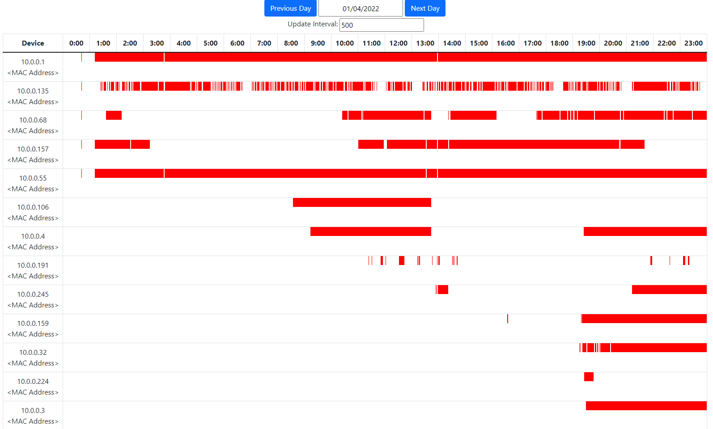

# LAN Monitor

### Overview

LAN Monitor is a app that can track online status of local connected device in real time. It utilizes Address Resolution
Protocol(ARP) to periodically broadcast ARP requests and track the response from local devices.

### Screenshot



The frontend is built with React and retrieve the data from the api.
Each rows represent online status of each device that is connected to the local network `10.0.0.0/24`.

### Deployment
1. Install Docker
2. Create the following configurations
    1. `./config.prod.yaml`:
       ```yaml
        mongodb:
          host: mongo
          port: 27017
          db: prod_lan_monitor
          username: <mongo_username>
          password: <mongo_password>
        ```
    2. `./.env.production.local`:
         ```js
         REACT_APP_API_URL='http://<host_url>:8080/api'
         ```
3. Complete docker-compose.prod.yaml:
```shell
version: '3.1'

services:
  mongo:
    image: apcheamitru/arm32v7-mongo:latest
    environment:
      MONGO_INITDB_ROOT_USERNAME: <mongo_username>
      MONGO_INITDB_ROOT_PASSWORD: <mongo_password>
    ports:
      - "27017:27017"
    volumes:
      - mongo-db:/data/db
    networks:
      - lan-monitor
  monitor:
    network_mode: host
    build:
      context: .
      dockerfile: ./lan_monitor/Dockerfile
    command: python -u lan_monitor/main.py -c ./config.prod.yaml -i 15 -s 2 -d
  api:
    build:
      context: .
      dockerfile: ./web/api/Dockerfile
    environment:
      FLASK_ENV: prod
    command: gunicorn -w 2 -b :5001 app:app
    expose:
      - "5001"
    networks:
      - lan-monitor
  nginx:
    build:
      context: .
      dockerfile: ./nginx/Dockerfile
    ports:
      - "8080:80"
    networks:
      - lan-monitor

volumes:
  mongo-db:

networks:
  lan-monitor:
    driver: bridge
```
   
5. Build and Run
```shell
#!/bin/bash

SRC_DIRECTORY="./lan-monitor"

rm -rf $SRC_DIRECTORY

git clone https://github.com/Larryun/lan-monitor

# docker-compose for production
cp ./docker-compose.prod.yaml $SRC_DIRECTORY/
# config for flask
cp ./config.prod.yaml $SRC_DIRECTORY/web/api/instance/
# config for lan-monitor
cp ./config.prod.yaml $SRC_DIRECTORY/config/
# config for react
cp ./.env.production.local $SRC_DIRECTORY/web/frontend/

cd $SRC_DIRECTORY

sudo docker-compose -f docker-compose.prod.yaml build
sudo docker-compose -f docker-compose.prod.yaml down
sudo docker-compose -f docker-compose.prod.yaml up -d
```

### Diagram
This app is built with Flask + MongoDB as the backend and React as the frontend. Deployed with Docker on a
local `Raspberry Pi` machine
```
┌─────────────────────────────────────────────────────────────┐
│ docker                                                      │
│                                                             │
│  ┌─────────────┐                                            │
│  │ lan-monitor │                                            │
│  └──────┬──────┘                                            │
│         │                                                   │
│         ▼                              ┌─────────┐          │
│    ┌─────────┐       ┌───────┐   /api  │         │          │
│    │ mongodb │◄──────┤ flask │◄────────┤         │          │
│    └─────────┘       └───────┘         │         │ 8080:80  │   ┌────────┐
│  localhost:27017   localhost:5001      │  nginx  │◄─────────┤◄──┤  user  │
│                  ┌───────────┐   /     │         │          │   └────────┘
│                  │ react app │◄────────┤         │          │
│                  └───────────┘         │         │          │
│                                        └─────────┘          │
│                                       localhost:80          │
└─────────────────────────────────────────────────────────────┘
```

There are 4 services in order to deploy this app:

- `lan-monitor`: a Python module based on Scapy that periodically broadcast ARP
requests, collect response and render result in the DB.
- `mongodb`: the database.
- `flask`: an API for the frontend, built with `flaks-restful`, served with `gunicorn` for
better performance.
- `nginx`: 
  - `/api`: serve `flask`.
  - `/`: the frontend, serve static files from the react app.

#### Project Structure
```
.
├── config
│   ├── config.dev.yaml
│   ├── config.prod.yaml
│   └── config.test.yaml
├── lan_monitor  <--------- the Python module based on Scapy 
│   │                       for handling ARP and the DB
│   ├── Dockerfile
│   ├── lan_monitor  <----- source code
│   ├── main.py
│   ├── README.md
│   └── setup.py
├── nginx  <--------------- configs for nginx
│   ├── Dockerfile
│   └── nginx.default.conf
├── requirements.txt
└── web  
    ├── api  <------------- source code for the flask api
    │   ├── app.py
    │   ├── db.py
    │   ├── Dockerfile
    │   ├── __init__.py
    │   ├── instance
    │   └── resource
    └── frontend  <-------- source code for the react app
        ├── package.json
        ├── package-lock.json
        ├── public
        ├── README.md
        └── src
```
